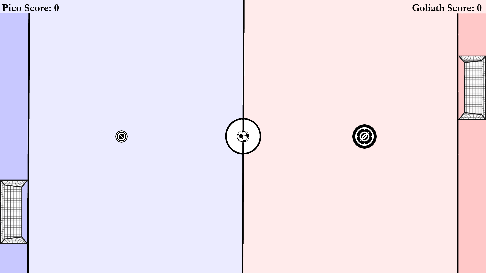
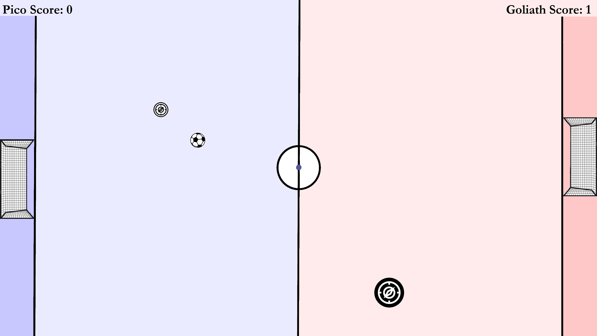
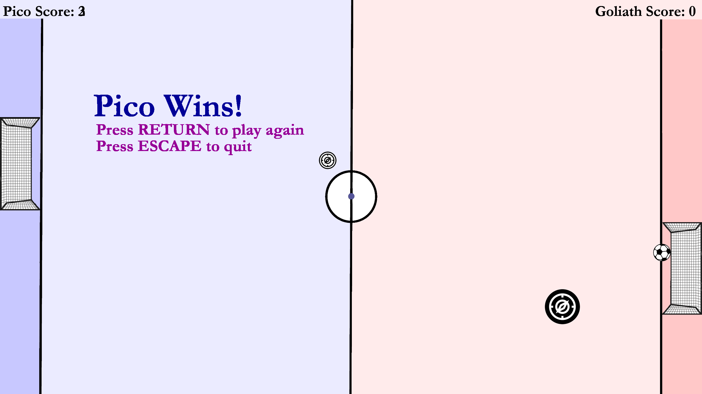
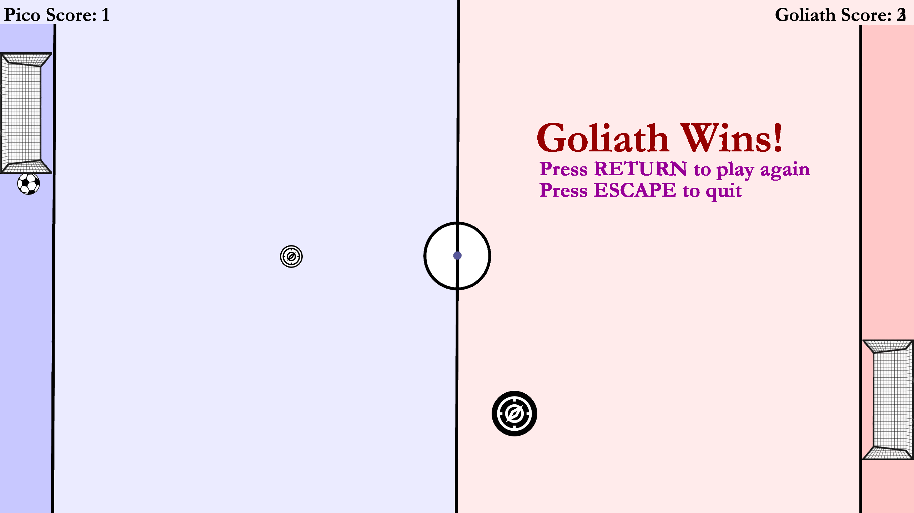
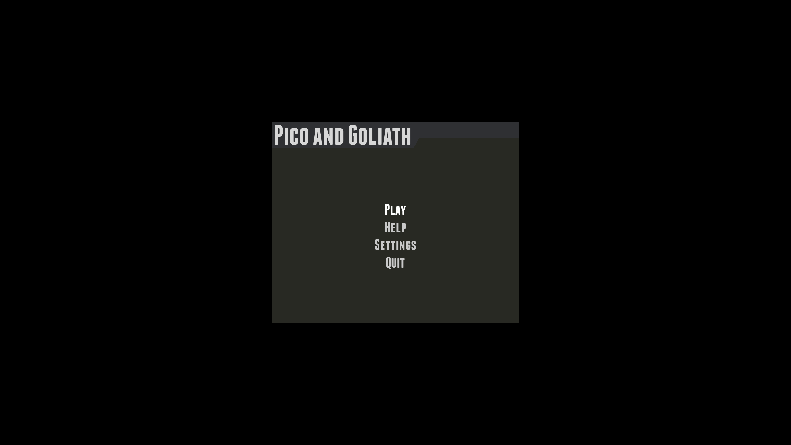
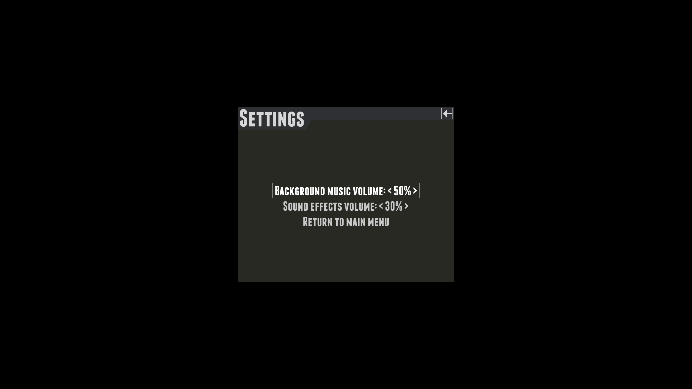

[![Contributors][contributors-shield]][contributors-url]
[![Forks][forks-shield]][forks-url]
[![Stargazers][stars-shield]][stars-url]
[![Issues][issues-shield]][issues-url]
[![MIT License][license-shield]][license-url]
[![LinkedIn][linkedin-shield]][linkedin-url]

<!-- PROJECT LOGO -->
<br />

<p align="center">
  <a href="https://github.com/chinarjoshi/pico-and-goliath">
    
  </a>

  <h1 align="center">Pico and Goliath</h1>

  <p align="center">
    Play a fast paced competitive 2-player arcade-style game
    <br />
    <a href="https://github.com/chinarjoshi/pico-and-goliath"><strong>Explore the docs »</strong></a>
    <br />
    <br />
    <a href="https://youtu.be/v6lsjcFfK9Q">View Demo</a>
    ·
    <a href="https://github.com/chinarjoshi/pico-and-goliath/issues">Report Bug</a>
    ·
    <a href="https://github.com/chinarjoshi/pico-and-goliath/issues">Request Feature</a>
  </p>
</p>

<!-- TABLE OF CONTENTS -->
<details open="open">
  <summary>Table of Contents</summary>
  <ol>
    <li>
      <a href="#about-the-project">About The Project</a>
      <ul>
        <li><a href="#built-with">Built With</a></li>
      </ul>
    </li>
    <li>
      <a href="#getting-started">Getting Started</a>
      <ul>
        <li><a href="#prerequisites">Prerequisites</a></li>
        <li><a href="#installation">Installation</a></li>
      </ul>
    </li>
    <li><a href="#usage">Usage</a></li>
    <li><a href="#roadmap">Roadmap</a></li>
    <li><a href="#contributing">Contributing</a></li>
    <li><a href="#license">License</a></li>
    <li><a href="#contact">Contact</a></li>
    <li><a href="#acknowledgements">Acknowledgements</a></li>
  </ol>
</details>


<!-- ABOUT THE PROJECT -->
## About The Project

<h3 align="center">
    This project was submitted to
    <a href="https://www.fultonschools.org/Page/9521">
        Fulton County Tech Fair
    </a>
</h3>

<p align="center">
  <a href="https://github.com/chinarjoshi/pico-and-goliath">
    
  </a>
</p>

### Description
*Pico and Goliath* is a fast paced competitive 2-player arcade-style game in which the players play as either Pico or Goliath. The objective of the game is to hit the ball into the opponent's moving goal 3 times. The combination of the two starkly different character paradigms combined with an innovative physics engine allows for very rich gameplay with a high skill-ceiling. 

#### Collision Engine

The way the physics engine is implemented is different from the standard billiard-ball collision; the collisions are based on the velocity and mass deltas alone, ignoring position deltas. This enables both Pico and Goliath to "catch" the ball and get a finer control over it. This feature allows the players to set up combo attacks using the boundaries of the game to their advantage.

### Inspiration
The name 'Pico' comes from the metric prefix for a trillionth, and 'Goliath' from the story of David and Goliath. My inspiration behind this game are two different paradigms of starting classes in Dark Souls. Pico is inspired from the thief build, who has high endurance and dexterity but starts with just a knife, and Goliath is inspired from the knight build, with a full body of armor and a broadsword, but cannot even roll. Thus, I took a creative approach and implmented these ideas in the form of interactive disks powered by a physics engine of my own implementation.


## Strategy Guide

### Pico:
Pico is fast and nimble, but he can’t hit the ball very hard. As such Pico should always stay in the same plane as the balls position because he can easily reach its position anywhere. However, if Goliath is able to power hit the ball on track to the goal, there is very little Pico can do. Thus, Pico's main strategy is to keep the ball out of favorable position for Goliath. He needs to act as the controller of the game, because once Pico loses control of the balls position, Goliath has the ability to quickly end the game. At the start of every round, Pico can of course reach the ball first, but he should try to rebound the ball of the edge so Goliath doesn’t have a clear strike on the goal. Pico also has the least inertia so it’s important to always stay in motion in order to take advantage of his strengths.


### Goliath:
Goliath is powerful also hefty. He can hit the ball with great power but is not very maneuverable. As such Goliath should always control the center and protect his goal, only leaving it when there’s an opportunity to strike. If Goliath misses his shot, this opens up the nimble Pico to deliver a quick strike to the goal. Goliath has a lot of inertia, so it’s important not to lose your position and hold central territory. If Goliath is out of position, it is much more lethal than for Pico. Goliath’s goal is to disrupt Pico's control of the ball or wait for him to make a mistake, in which he had the power to end the game very quickly. Once Goliath lands a powerful strike on the ball on target to the goal, Pico is too light to stop it in time. However, Goliath cannot ball hog because the goals constantly move in opposite directions

#### Combo attacks
Because of the physics engine, both players have access to a new feature called combo attacks. By grabbing the ball, they are able to bounce it off one of their walls, accelerate it through their body, and hit the ball again before it crosses the border. This technique accelerates the ball to its maximum speed, and there is very little the opponent can do then.

This technique is primarily useful for Goliath as his large hitbox allows him to control the ball easier. However, a skilled player will be able to utilize this feature regarless of what character he plays.

### Recap

While both characters are equally difficult, they have vastly different play styles. Pico is like a knife while Goliath is like a claymore. Pico aims to get quick strikes and avoid giving Goliath the opportunity to strike, while Goliath aims to set up his position to land a game-ending strike.

A skilled Pico player knows how to control the ball and always be in the game, and a skilled Goliath player knows when to be patient when when the opportunity to strike arises. 


### Built With

* [Pygame](https://www.pygame.org/news)
* [Pygame-Menu](https://pygame-menu.readthedocs.io/en/3.5.8/)


## Getting Started

The application may be run through either the precompiled binary or running the main.py file.

### Prerequisites
**Only necessary for latter option**

* pip
  ```sh
  pip install -r requirements.txt
  ```

### How to use

Launch PicoAndGoliath.exe
*Note: Windows defender may mark the precompiled binary as a threat as it is an unregistered executable. However, it is safe to download.*

**OR**

#### Compile Source

1. Clone the repo
   ```sh
   git clone https://github.com/chinarjoshi/pico-and-goliath
   ```
2. Install prerequisite packages
   ```sh
   pip install -r requirements.txt
   ```
4. Directly run the python file
   ```sh
   python pico-and-goliath/main.py
   ```

<!-- USAGE EXAMPLES -->
## Gallery

<p align="center">
  <a href="https://github.com/chinarjoshi/pico-and-goliath">
    
  </a>
</p>

<p align="center">
  <a href="https://github.com/chinarjoshi/pico-and-goliath">
    
  </a>
</p>

<p align="center">
  <a href="https://github.com/chinarjoshi/pico-and-goliath">
    
  </a>
</p>

<p align="center">
  <a href="https://github.com/chinarjoshi/pico-and-goliath">
    
  </a>
</p>

<p align="center">
  <a href="https://github.com/chinarjoshi/pico-and-goliath">
    
  </a>
</p>


_For more examples, please refer to the [Documentation](https://github.com/chinarjoshi/pico-and-goliath)_

<!-- ROADMAP -->
## Roadmap

__See the [open issues](https://github.com/chinarjoshi/pico-and-goliath/issues) for a list of proposed features (and known issues).__
<br>

The following features and balance changes will be implemented in the future:
1. Powerups:
    - Pico moves faster
    - Goliath hits the ball harder
    - Either player gets a second avater of themselves
2.  Tweak physics engine to buff Goliath's power.
3.  Give option to change character's size and speed in settings.


<!-- CONTRIBUTING -->
## Contributing

Any contributions to extend features are **greatly appreciated**.

1. Fork the Project
2. Create your Feature Branch (`git checkout -b feature/newFeature`)
3. Commit your Changes (`git commit -m 'Add NewFeature'`)
4. Push to the Branch (`git push origin feature/newFeature`)
5. Open a Pull Request


<!-- LICENSE -->
## License

Distributed under the MIT License. See `LICENSE` for more information.


<!-- CONTACT -->
## Contact

Chinar Joshi - chinarjoshi7@gmail.com - [Linkedin](https://linkedin.com/in/chinar-joshi-905493207/)

Project Link: [Github](https://github.com/chinarjoshi/pico-and-goliath)


## Acknowledgements
*For image and audio acknowledgements, please see acknowledgements.md*
* [Readme Template](https://github.com/othneildrew/Best-README-Template)
* [Img Shields](https://shields.io)
* [GitHub Pages](https://pages.github.com)
* [Animate.css](https://daneden.github.io/animate.css)
* [Loaders.css](https://connoratherton.com/loaders)

<!-- MARKDOWN LINKS & IMAGES -->
<!-- https://www.markdownguide.org/basic-syntax/#reference-style-links -->
[contributors-shield]: https://img.shields.io/github/contributors/chinarjoshi/pico-and-goliath?style=for-the-badge
[contributors-url]: https://github.com/chinarjoshi/pico-and-goliath/graphs/contributors
[forks-shield]: https://img.shields.io/github/forks/chinarjoshi/pico-and-goliath?style=for-the-badge
[forks-url]: https://github.com/chinarjoshi/pico-and-goliath/network/members
[stars-shield]: https://img.shields.io/github/stars/chinarjoshi/pico-and-goliath?style=for-the-badge
[stars-url]: https://github.com/chinarjoshi/pico-and-goliath/stargazers
[issues-shield]: https://img.shields.io/github/issues/chinarjoshi/pico-and-goliath?style=for-the-badge
[issues-url]: https://github.com/chinarjoshi/pico-and-goliath/issues
[license-shield]: https://img.shields.io/github/license/chinarjoshi/pico-and-goliath?style=for-the-badge
[license-url]: https://github.com/chinarjoshi/pico-and-goliath/blob/master/LICENSE
[linkedin-shield]: https://img.shields.io/badge/-LinkedIn-black.svg?style=for-the-badge&logo=linkedin&colorB=555
[linkedin-url]: https://www.linkedin.com/in/chinar-joshi-905493207/
[product-screenshot]: images/screenshot.png
